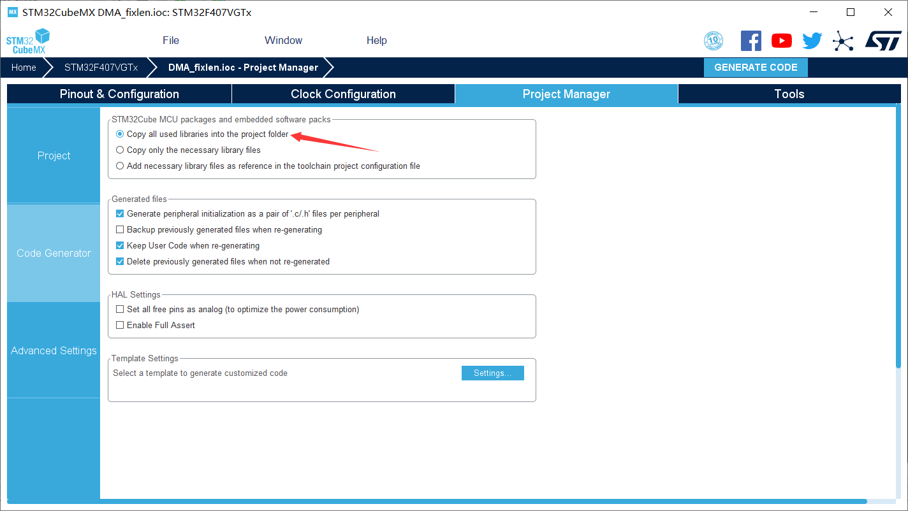
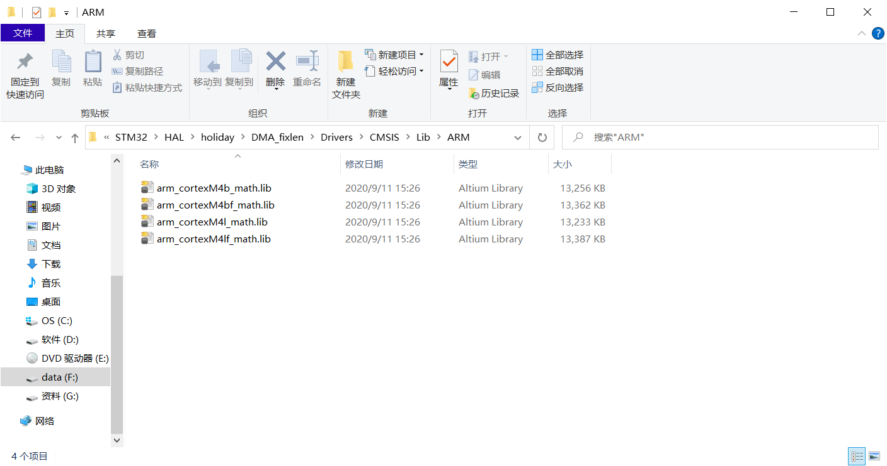
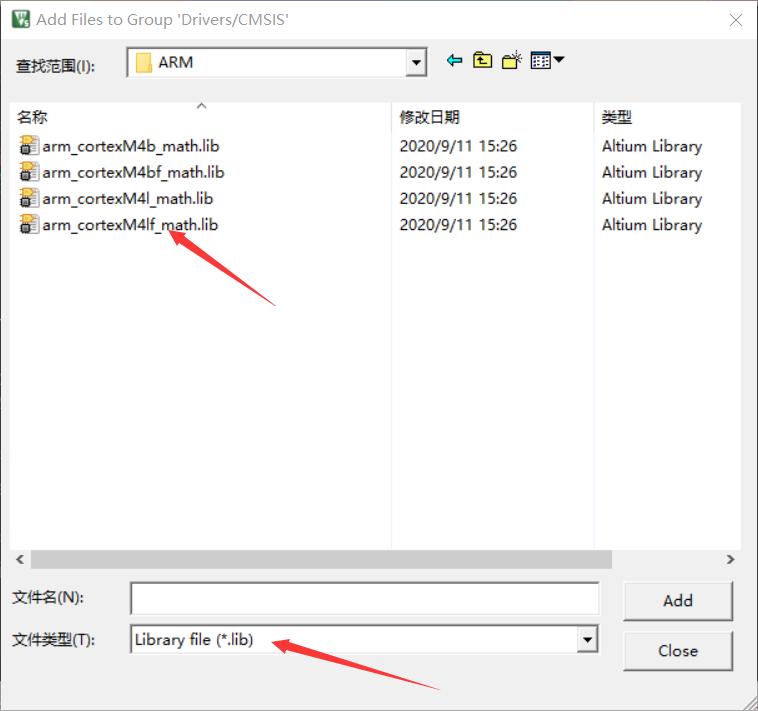
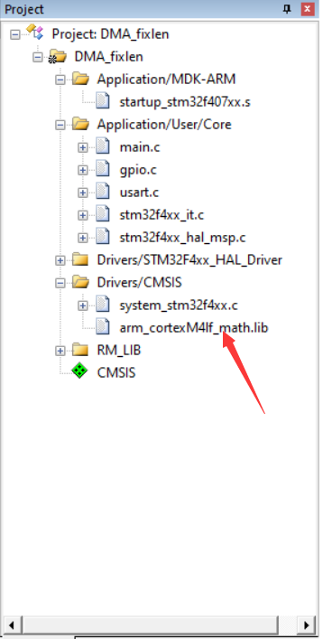
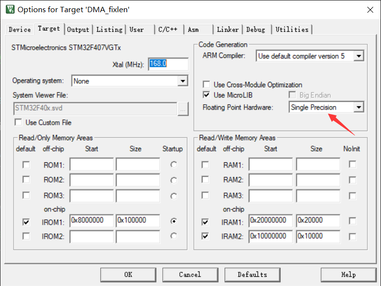
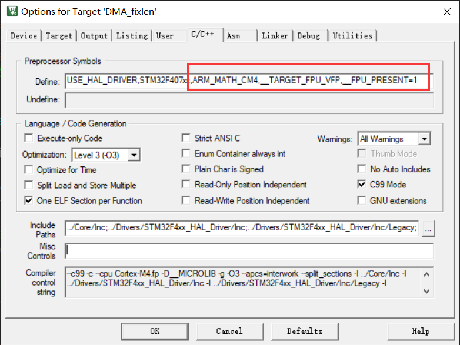
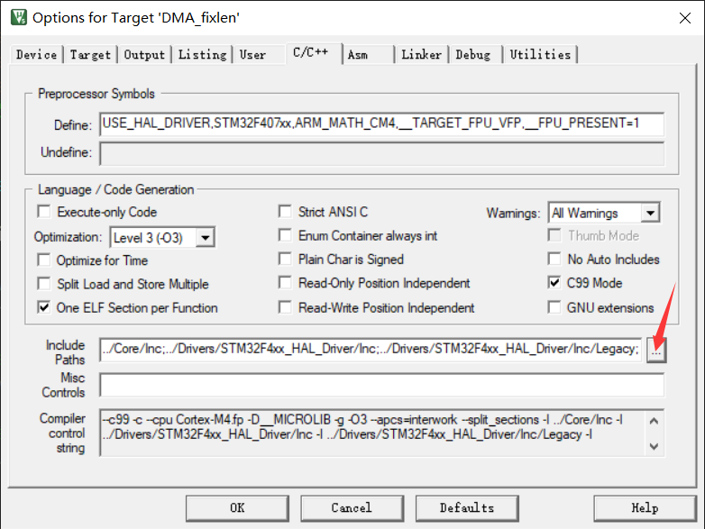
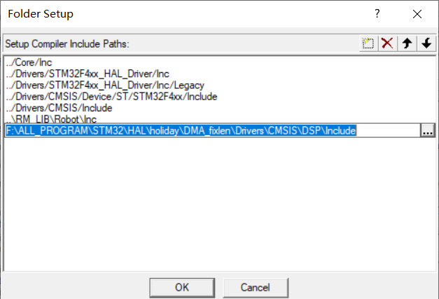

# DSP库的添加

软件环境：STM32CubeMX、Keil5
硬件环境：STM32F407

#### **1**.使用STM32CubeMX生成Keil5工程

注意：点击Project -> Settings打开工程设置窗口，点击Code Generator选项卡，在STM32Cube Firmware Library Package中选择Copy all used libraries into the project folder。

#### **2**.打开并配置Keil 5工程

(1)打开keil 5工程
(2)添加DSP库到工程中
若使用的是STM32CubeMX生成的工程，DSP库文件就在工程目录中，位于.\Drivers\CMSIS\Lib\ARM，里面有4个文件：

注：‘b’表示大端格式（Big Endian），‘l’表示小端格式（Little Endian），‘f’表示带浮点数。
我们目前使用的硬件平台是STM32F407系列，它带有FPU，同时使用的是小端格式，因此使用arm_cortexM4lf_math.lib，将它添加到工程中(可添加到Drivers/CMSIS文件夹下)。

(3)点击 Project -> Options for Target，打开工程选项界面，点击Target选项卡，在Code Generation区域的Floating Point Hardware中选择Single Precision（单精度）。

点击C/C++选项卡，在Preprocessor Symbols区域的Define中添加如下内容：  
ARM_MATH_CM4,__TARGET_FPU_VFP,__FPU_PRESENT=1  

    

ARM_MATH_CM4表示在CM4中使用MATH库
__TARGET_FPU_VFP表示在目标设备中使用FPU
__FPU_PRESENT=1表示开启FPU，这个宏其实在stm32f407xx.h中有定义时，但是它并没有在core_cm4.h中起作用，在编译的时候会报错，应该是跟文件的编译顺序有关系，因此为了正常编译，在这里添加它(若编译后报incompatible redefinition的警告, 则FPU_PRESENT=1这句话可以略去不加)   
在C/C++选项卡中,的Include Paths中添加DSP库的路径：\Drivers\CMSIS\DSP\Include 

    

(4)使用DSP库
在相应的.c文件中添加头文件：arm_math.h、arm_const_structs.h即可使用。  
注：在官方的HAL库中有DSP库相关的使用例程，位于
C:\Users\Administrator\STM32Cube\Repository\STM32Cube_FW_F4_V1.21.0\Drivers\CMSIS\DSP_Lib\Examples（这个是我的目录）

